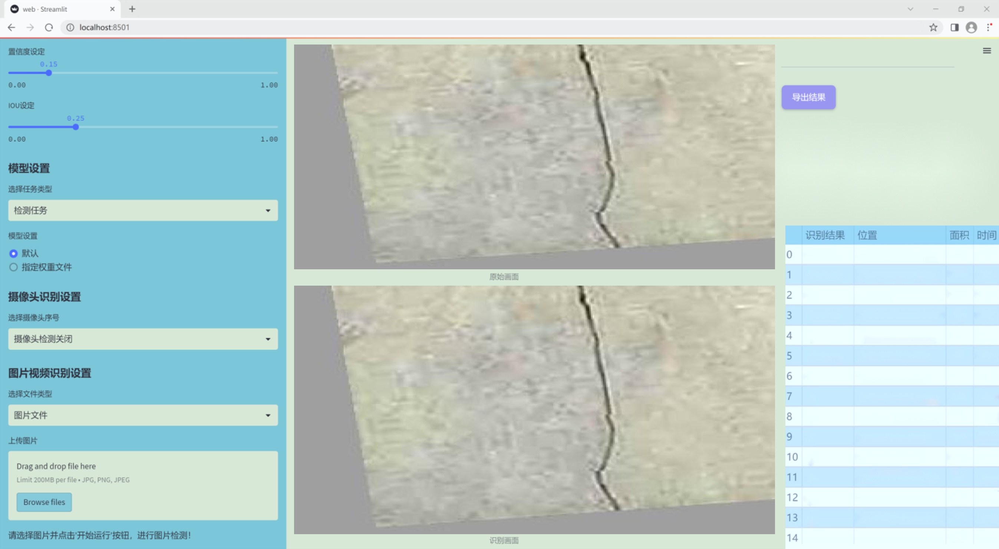
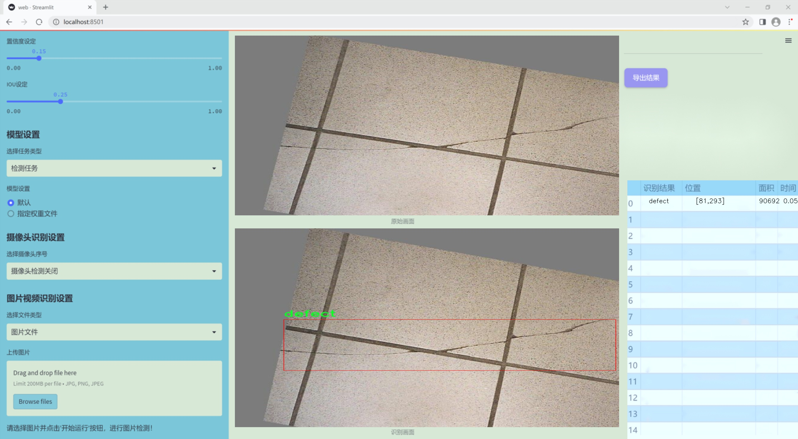
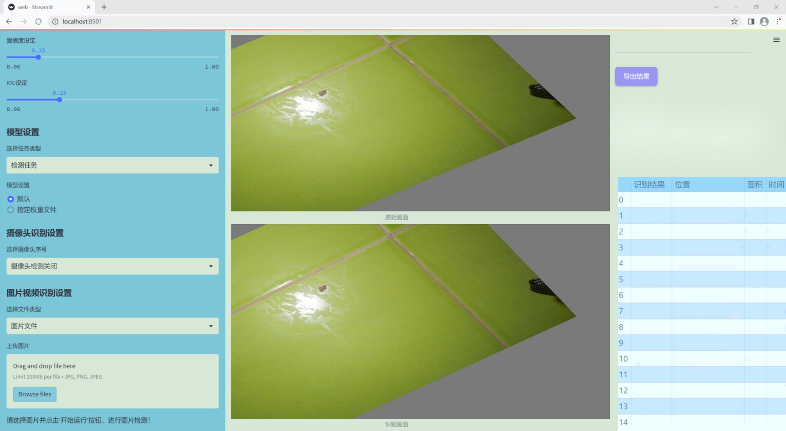
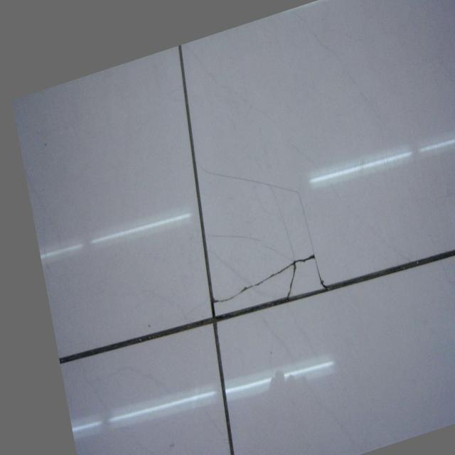
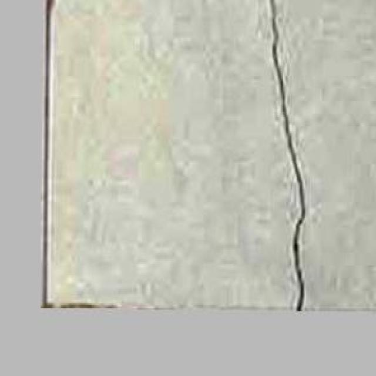
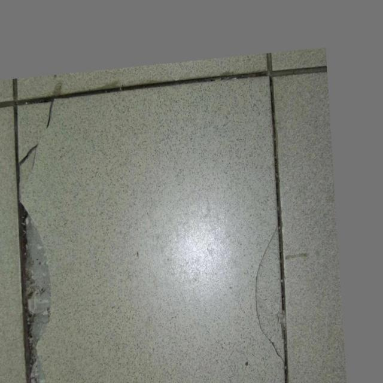
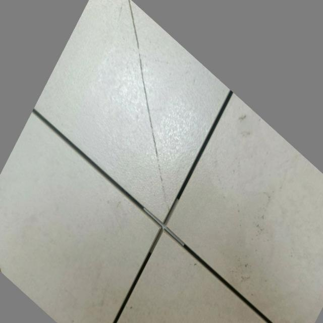
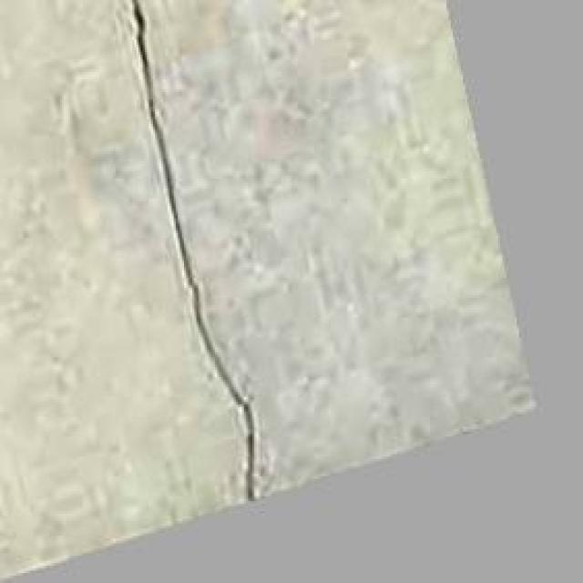

### 1.背景意义

研究背景与意义

随着工业自动化和智能制造的迅速发展，表面缺陷检测技术在产品质量控制中扮演着越来越重要的角色。瓷砖作为一种广泛应用于建筑和室内装饰的材料，其表面质量直接影响到产品的市场竞争力和消费者的使用体验。因此，开发高效、准确的瓷砖表面缺陷检测系统显得尤为重要。传统的人工检测方法不仅耗时耗力，而且容易受到人为因素的影响，导致检测结果的不一致性和准确性不足。为了解决这一问题，基于深度学习的计算机视觉技术逐渐成为表面缺陷检测的主流解决方案。

在众多深度学习模型中，YOLO（You Only Look Once）系列模型因其高效的实时检测能力而受到广泛关注。YOLOv11作为该系列的最新版本，结合了更先进的网络结构和算法优化，能够在保持高检测精度的同时，实现更快的推理速度。针对瓷砖表面缺陷的检测需求，改进YOLOv11模型能够有效提升对缺陷的识别能力，尤其是在复杂背景和多变光照条件下的表现。

本研究所使用的数据集包含497张瓷砖表面图像，所有图像均已按照YOLOv8格式进行了缺陷标注。数据集中仅包含一个类别“defect”，这为模型的训练和评估提供了明确的目标。尽管未应用图像增强技术，但通过对图像进行自动方向调整和统一尺寸处理，确保了数据集的质量和一致性。这为后续的模型训练和性能评估奠定了良好的基础。

综上所述，基于改进YOLOv11的瓷砖表面缺陷检测系统不仅能够提高检测效率和准确性，还能为瓷砖生产企业提供有效的质量控制手段，推动智能制造的发展。因此，本研究具有重要的理论意义和实际应用价值。

### 2.视频效果

[2.1 视频效果](https://www.bilibili.com/video/BV1VQUVYxEiq/)

### 3.图片效果







##### [项目涉及的源码数据来源链接](https://kdocs.cn/l/cszuIiCKVNis)**

注意：本项目提供训练的数据集和训练教程,由于版本持续更新,暂不提供权重文件（best.pt）,请按照6.训练教程进行训练后实现上图演示的效果。

### 4.数据集信息

##### 4.1 本项目数据集类别数＆类别名

nc: 1
names: ['defect']


该项目为【目标检测】数据集，请在【训练教程和Web端加载模型教程（第三步）】这一步的时候按照【目标检测】部分的教程来训练

##### 4.2 本项目数据集信息介绍

本项目数据集信息介绍

本项目旨在开发一个改进版的YOLOv11模型，以实现瓷砖表面缺陷的高效检测。为此，我们构建了一个专门的数据集，聚焦于瓷砖表面缺陷的识别与分类。该数据集的主题为“plitka”，涵盖了瓷砖表面可能出现的各种缺陷。数据集中包含的类别数量为1，具体类别为“defect”，这意味着所有的样本均为瓷砖表面缺陷的实例。通过这种简化的类别设置，我们能够集中精力提高模型对瓷砖缺陷的检测精度。

数据集的构建过程包括了从多个来源收集瓷砖表面缺陷的图像，确保样本的多样性和代表性。所收集的图像涵盖了不同类型的瓷砖、不同的表面处理工艺以及各种环境条件下的拍摄效果。这种多样性不仅增强了数据集的广泛性，也为模型的训练提供了丰富的特征信息，使其能够更好地适应实际应用中的各种情况。

在数据预处理阶段，我们对图像进行了标注，确保每个缺陷实例都被准确地框定。这一过程不仅提高了数据集的质量，也为后续的模型训练提供了坚实的基础。经过标注的图像将被用于训练、验证和测试模型，以确保其在不同场景下的泛化能力。

通过本项目的数据集，我们期望能够显著提升YOLOv11在瓷砖表面缺陷检测任务中的表现，进而推动相关领域的研究与应用。我们相信，随着数据集的不断优化和扩展，未来的模型将能够更精准地识别瓷砖表面的各种缺陷，为瓷砖生产和质量控制提供有力支持。











### 5.全套项目环境部署视频教程（零基础手把手教学）

[5.1 所需软件PyCharm和Anaconda安装教程（第一步）](https://www.bilibili.com/video/BV1BoC1YCEKi/?spm_id_from=333.999.0.0&vd_source=bc9aec86d164b67a7004b996143742dc)


[5.2 安装Python虚拟环境创建和依赖库安装视频教程（第二步）](https://www.bilibili.com/video/BV1ZoC1YCEBw?spm_id_from=333.788.videopod.sections&vd_source=bc9aec86d164b67a7004b996143742dc)

### 6.改进YOLOv11训练教程和Web_UI前端加载模型教程（零基础手把手教学）

[6.1 改进YOLOv11训练教程和Web_UI前端加载模型教程（第三步）](https://www.bilibili.com/video/BV1BoC1YCEhR?spm_id_from=333.788.videopod.sections&vd_source=bc9aec86d164b67a7004b996143742dc)


按照上面的训练视频教程链接加载项目提供的数据集，运行train.py即可开始训练



     Epoch   gpu_mem       box       obj       cls    labels  img_size
     1/200     20.8G   0.01576   0.01955  0.007536        22      1280: 100%|██████████| 849/849 [14:42<00:00,  1.04s/it]
               Class     Images     Labels          P          R     mAP@.5 mAP@.5:.95: 100%|██████████| 213/213 [01:14<00:00,  2.87it/s]
                 all       3395      17314      0.994      0.957      0.0957      0.0843

     Epoch   gpu_mem       box       obj       cls    labels  img_size
     2/200     20.8G   0.01578   0.01923  0.007006        22      1280: 100%|██████████| 849/849 [14:44<00:00,  1.04s/it]
               Class     Images     Labels          P          R     mAP@.5 mAP@.5:.95: 100%|██████████| 213/213 [01:12<00:00,  2.95it/s]
                 all       3395      17314      0.996      0.956      0.0957      0.0845

     Epoch   gpu_mem       box       obj       cls    labels  img_size
     3/200     20.8G   0.01561    0.0191  0.006895        27      1280: 100%|██████████| 849/849 [10:56<00:00,  1.29it/s]
               Class     Images     Labels          P          R     mAP@.5 mAP@.5:.95: 100%|███████   | 187/213 [00:52<00:00,  4.04it/s]
                 all       3395      17314      0.996      0.957      0.0957      0.0845


###### [项目数据集下载链接](https://kdocs.cn/l/cszuIiCKVNis)

### 7.原始YOLOv11算法讲解


##### YOLOv11三大损失函数

YOLOv11（You Only Look Once）是一种流行的目标检测算法，其损失函数设计用于同时优化分类和定位任务。YOLO的损失函数通常包括几个部分：
**分类损失、定位损失（边界框回归损失）和置信度损失** 。其中，

  1. box_loss（边界框回归损失）是用于优化预测边界框与真实边界框之间的差异的部分。

  2. cls_loss（分类损失）是用于优化模型对目标类别的预测准确性的部分。分类损失确保模型能够正确地识别出图像中的对象属于哪个类别。

  3. dfl_loss（Distribution Focal Loss）是YOLO系列中的一种损失函数，特别是在一些改进版本如YOLOv5和YOLOv7中被引入。它的主要目的是解决目标检测中的类别不平衡问题，并提高模型在处理小目标和困难样本时的性能。

##### 边界框回归损失详解

box_loss（边界框回归损失）是用于优化预测边界框与真实边界框之间的差异的部分。


##### box_loss 的具体意义


##### 为什么需要 box_loss

  * 精确定位：通过最小化中心点坐标损失和宽高损失，模型能够更准确地预测目标的位置和大小。
  * 平衡不同类型的目标：使用平方根来处理宽高损失，可以更好地平衡不同大小的目标，确保小目标也能得到足够的关注。
  * 稳定训练：适当的损失函数设计有助于模型的稳定训练，避免梯度爆炸或消失等问题。

##### 分类损失详解

在YOLO（You Only Look
Once）目标检测算法中，cls_loss（分类损失）是用于优化模型对目标类别的预测准确性的部分。分类损失确保模型能够正确地识别出图像中的对象属于哪个类别。下面是关于cls_loss的详细解读：

##### 分类损失 (cls_loss) 的具体意义

  
分类损失通常使用交叉熵损失（Cross-Entropy
Loss）来计算。交叉熵损失衡量的是模型预测的概率分布与真实标签之间的差异。在YOLO中，分类损失的具体形式如下：


##### 为什么需要 cls_loss

  * 类别识别：cls_loss 确保模型能够正确识别出图像中的目标属于哪个类别。这对于目标检测任务至关重要，因为不仅需要知道目标的位置，还需要知道目标的类型。

  * 多类别支持：通过最小化分类损失，模型可以处理多个类别的目标检测任务。例如，在道路缺陷检测中，可能需要识别裂缝、坑洞、路面破损等多种类型的缺陷。

  * 提高准确性：分类损失有助于提高模型的分类准确性，从而提升整体检测性能。通过优化分类损失，模型可以更好地学习不同类别之间的特征差异。

##### 分布损失详解

`dfl_loss`（Distribution Focal
Loss）是YOLO系列中的一种损失函数，特别是在一些改进版本如YOLOv5和YOLOv7中被引入。它的主要目的是解决目标检测中的类别不平衡问题，并提高模型在处理小目标和困难样本时的性能。下面是对`dfl_loss`的详细解读：

##### DFL Loss 的背景

在目标检测任务中，类别不平衡是一个常见的问题。某些类别的样本数量可能远远多于其他类别，这会导致模型在训练过程中对常见类别的学习效果较好，而对罕见类别的学习效果较差。此外，小目标和困难样本的检测也是一个挑战，因为这些目标通常具有较少的特征信息，容易被忽略或误分类。

为了应对这些问题，研究者们提出了多种改进方法，其中之一就是`dfl_loss`。`dfl_loss`通过引入分布焦点损失来增强模型对困难样本的关注，并改善类别不平衡问题。

##### DFL Loss 的定义

DFL Loss
通常与传统的交叉熵损失结合使用，以增强模型对困难样本的学习能力。其核心思想是通过对每个类别的预测概率进行加权，使得模型更加关注那些难以正确分类的样本。

DFL Loss 的公式可以表示为：


##### DFL Loss 的具体意义**

  * **类别不平衡：** 通过引入平衡因子 α，DFL Loss 可以更好地处理类别不平衡问题。对于少数类别的样本，可以通过增加其权重来提升其重要性，从而提高模型对这些类别的检测性能。
  *  **困难样本：** 通过聚焦参数 γ，DFL Loss 可以让模型更加关注那些难以正确分类的样本。当 
  * γ 较大时，模型会对那些预测概率较低的样本给予更多的关注，从而提高这些样本的分类准确性。
  *  **提高整体性能** ：DFL Loss 结合了传统交叉熵损失的优势，并通过加权机制增强了模型对困难样本的学习能力，从而提高了整体的检测性能。


### 8.200+种全套改进YOLOV11创新点原理讲解

#### 8.1 200+种全套改进YOLOV11创新点原理讲解大全

由于篇幅限制，每个创新点的具体原理讲解就不全部展开，具体见下列网址中的改进模块对应项目的技术原理博客网址【Blog】（创新点均为模块化搭建，原理适配YOLOv5~YOLOv11等各种版本）

[改进模块技术原理博客【Blog】网址链接](https://gitee.com/qunmasj/good)


#### 8.2 精选部分改进YOLOV11创新点原理讲解

###### 这里节选部分改进创新点展开原理讲解(完整的改进原理见上图和[改进模块技术原理博客链接](https://gitee.com/qunmasj/good)【如果此小节的图加载失败可以通过CSDN或者Github搜索该博客的标题访问原始博客，原始博客图片显示正常】

### Gold-YOLO简介
YOLO再升级：华为诺亚提出Gold-YOLO，聚集-分发机制打造新SOTA
在过去的几年中，YOLO系列模型已经成为实时目标检测领域的领先方法。许多研究通过修改架构、增加数据和设计新的损失函数，将基线推向了更高的水平。然而以前的模型仍然存在信息融合问题，尽管特征金字塔网络（FPN）和路径聚合网络（PANet）已经在一定程度上缓解了这个问题。因此，本研究提出了一种先进的聚集和分发机制（GD机制），该机制通过卷积和自注意力操作实现。这种新设计的模型被称为Gold-YOLO，它提升了多尺度特征融合能力，在所有模型尺度上实现了延迟和准确性的理想平衡。此外，本文首次在YOLO系列中实现了MAE风格的预训练，使得YOLO系列模型能够从无监督预训练中受益。Gold-YOLO-N在COCO val2017数据集上实现了出色的39.9% AP，并在T4 GPU上实现了1030 FPS，超过了之前的SOTA模型YOLOv6-3.0-N，其FPS相似，但性能提升了2.4%。


#### Gold-YOLO


YOLO系列的中间层结构采用了传统的FPN结构，其中包含多个分支用于多尺度特征融合。然而，它只充分融合来自相邻级别的特征，对于其他层次的信息只能间接地进行“递归”获取。

传统的FPN结构在信息传输过程中存在丢失大量信息的问题。这是因为层之间的信息交互仅限于中间层选择的信息，未被选择的信息在传输过程中被丢弃。这种情况导致某个Level的信息只能充分辅助相邻层，而对其他全局层的帮助较弱。因此，整体上信息融合的有效性可能受到限制。
为了避免在传输过程中丢失信息，本文采用了一种新颖的“聚集和分发”机制（GD），放弃了原始的递归方法。该机制使用一个统一的模块来收集和融合所有Level的信息，并将其分发到不同的Level。通过这种方式，作者不仅避免了传统FPN结构固有的信息丢失问题，还增强了中间层的部分信息融合能力，而且并没有显著增加延迟。


# 8.低阶聚合和分发分支 Low-stage gather-and-distribute branch
从主干网络中选择输出的B2、B3、B4、B5特征进行融合，以获取保留小目标信息的高分辨率特征。


低阶特征对齐模块 (Low-stage feature alignment module)： 在低阶特征对齐模块（Low-FAM）中，采用平均池化（AvgPool）操作对输入特征进行下采样，以实现统一的大小。通过将特征调整为组中最小的特征大小（ R B 4 = 1 / 4 R ） （R_{B4} = 1/4R）（R 
B4 =1/4R），我们得到对齐后的特征F a l i g n F_{align}F align 。低阶特征对齐技术确保了信息的高效聚合，同时通过变换器模块来最小化后续处理的计算复杂性。其中选择 R B 4 R_{B4}R B4 作为特征对齐的目标大小主要基于保留更多的低层信息的同时不会带来较大的计算延迟。
低阶信息融合模块(Low-stage information fusion module)： 低阶信息融合模块（Low-IFM）设计包括多层重新参数化卷积块（RepBlock）和分裂操作。具体而言，RepBlock以F a l i g n ( c h a n n e l = s u m ( C B 2 ， C B 3 ， C B 4 ， C B 5 ) ) F_{align} (channel= sum(C_{B2}，C_{B3}，C_{B4}，C_{B5}))F align (channel=sum(C B2 ，C B3 ，C B4 ，C B5 )作为输入，并生成F f u s e ( c h a n n e l = C B 4 + C B 5 ) F_{fuse} (channel= C_{B4} + C_{B5})F fuse (channel=C B4 +C B5 )。其中中间通道是一个可调整的值（例如256），以适应不同的模型大小。由RepBlock生成的特征随后在通道维度上分裂为F i n j P 3 Finj_P3Finj P 3和F i n j P 4 Finj_P4Finj P 4，然后与不同级别的特征进行融合。


# 8.高阶聚合和分发分支 High-stage gather-and-distribute branch
高级全局特征对齐模块（High-GD）将由低级全局特征对齐模块（Low-GD）生成的特征{P3, P4, P5}进行融合。


高级特征对齐模块(High-stage feature alignment module)： High-FAM由avgpool组成，用于将输入特征的维度减小到统一的尺寸。具体而言，当输入特征的尺寸为{R P 3 R_{P3}R P3 , R P 4 R_{P4}R P4 , R P 5 R_{P 5}R P5 }时，avgpool将特征尺寸减小到该特征组中最小的尺寸（R P 5 R_{P5}R P5  = 1/8R）。由于transformer模块提取了高层次的信息，池化操作有助于信息聚合，同时降低了transformer模块后续步骤的计算需求。

Transformer融合模块由多个堆叠的transformer组成，transformer块的数量为L。每个transformer块包括一个多头注意力块、一个前馈网络（FFN）和残差连接。采用与LeViT相同的设置来配置多头注意力块，使用16个通道作为键K和查询Q的头维度，32个通道作为值V的头维度。为了加速推理过程，将层归一化操作替换为批归一化，并将所有的GELU激活函数替换为ReLU。为了增强变换器块的局部连接，在两个1x1卷积层之间添加了一个深度卷积层。同时，将FFN的扩展因子设置为2，以在速度和计算成本之间取得平衡。

信息注入模块(Information injection module)： 高级全局特征对齐模块（High-GD）中的信息注入模块与低级全局特征对齐模块（Low-GD）中的相同。在高级阶段，局部特征（Flocal）等于Pi，因此公式如下所示：


### 增强的跨层信息流动 Enhanced cross-layer information flow
为了进一步提升性能，从YOLOv11 中的PAFPN模块中得到启发，引入了Inject-LAF模块。该模块是注入模块的增强版，包括了一个轻量级相邻层融合（LAF）模块，该模块被添加到注入模块的输入位置。为了在速度和准确性之间取得平衡，设计了两个LAF模型：LAF低级模型和LAF高级模型，分别用于低级注入（合并相邻两层的特征）和高级注入（合并相邻一层的特征）。它们的结构如图5(b)所示。为了确保来自不同层级的特征图与目标大小对齐，在实现中的两个LAF模型仅使用了三个操作符：双线性插值（上采样过小的特征）、平均池化（下采样过大的特征）和1x1卷积（调整与目标通道不同的特征）。模型中的LAF模块与信息注入模块的结合有效地平衡了准确性和速度之间的关系。通过使用简化的操作，能够增加不同层级之间的信息流路径数量，从而提高性能而不显著增加延迟。


### 9.系统功能展示

图9.1.系统支持检测结果表格显示

  图9.2.系统支持置信度和IOU阈值手动调节

  图9.3.系统支持自定义加载权重文件best.pt(需要你通过步骤5中训练获得)

  图9.4.系统支持摄像头实时识别

  图9.5.系统支持图片识别

  图9.6.系统支持视频识别

  图9.7.系统支持识别结果文件自动保存

  图9.8.系统支持Excel导出检测结果数据


### 10. YOLOv11核心改进源码讲解

#### 10.1 fasternet.py

以下是经过简化和注释的核心代码，保留了FasterNet模型的主要结构和功能：

```python
import torch
import torch.nn as nn
from typing import List
from torch import Tensor

class PartialConv3(nn.Module):
    """部分卷积层，用于处理输入特征图的部分通道。"""
    
    def __init__(self, dim, n_div, forward):
        super().__init__()
        self.dim_conv3 = dim // n_div  # 被卷积的通道数
        self.dim_untouched = dim - self.dim_conv3  # 未被卷积的通道数
        self.partial_conv3 = nn.Conv2d(self.dim_conv3, self.dim_conv3, 3, 1, 1, bias=False)  # 3x3卷积

        # 根据前向传播方式选择相应的前向传播函数
        if forward == 'slicing':
            self.forward = self.forward_slicing
        elif forward == 'split_cat':
            self.forward = self.forward_split_cat
        else:
            raise NotImplementedError

    def forward_slicing(self, x: Tensor) -> Tensor:
        """仅用于推理阶段，保持原始输入不变。"""
        x = x.clone()  # 克隆输入以保留原始数据
        x[:, :self.dim_conv3, :, :] = self.partial_conv3(x[:, :self.dim_conv3, :, :])  # 处理部分通道
        return x

    def forward_split_cat(self, x: Tensor) -> Tensor:
        """用于训练和推理阶段，分割并拼接特征图。"""
        x1, x2 = torch.split(x, [self.dim_conv3, self.dim_untouched], dim=1)  # 分割通道
        x1 = self.partial_conv3(x1)  # 对分割的部分进行卷积
        x = torch.cat((x1, x2), 1)  # 拼接通道
        return x


class MLPBlock(nn.Module):
    """多层感知机块，包含卷积和激活层。"""
    
    def __init__(self, dim, n_div, mlp_ratio, drop_path, act_layer, norm_layer, pconv_fw_type):
        super().__init__()
        self.dim = dim
        self.mlp_ratio = mlp_ratio
        self.drop_path = nn.Identity() if drop_path <= 0 else nn.Dropout(drop_path)  # 随机丢弃层
        mlp_hidden_dim = int(dim * mlp_ratio)  # 隐藏层维度

        # 定义MLP结构
        self.mlp = nn.Sequential(
            nn.Conv2d(dim, mlp_hidden_dim, 1, bias=False),
            norm_layer(mlp_hidden_dim),
            act_layer(),
            nn.Conv2d(mlp_hidden_dim, dim, 1, bias=False)
        )

        # 空间混合层
        self.spatial_mixing = PartialConv3(dim, n_div, pconv_fw_type)

    def forward(self, x: Tensor) -> Tensor:
        """前向传播函数。"""
        shortcut = x  # 残差连接
        x = self.spatial_mixing(x)  # 空间混合
        x = shortcut + self.drop_path(self.mlp(x))  # 残差连接与丢弃
        return x


class PatchEmbed(nn.Module):
    """图像块嵌入层，将输入图像分割为小块并嵌入。"""
    
    def __init__(self, patch_size, patch_stride, in_chans, embed_dim, norm_layer):
        super().__init__()
        self.proj = nn.Conv2d(in_chans, embed_dim, kernel_size=patch_size, stride=patch_stride, bias=False)
        self.norm = norm_layer(embed_dim) if norm_layer is not None else nn.Identity()

    def forward(self, x: Tensor) -> Tensor:
        """前向传播，嵌入图像块并进行归一化。"""
        x = self.norm(self.proj(x))
        return x


class FasterNet(nn.Module):
    """FasterNet模型，包含多个阶段和嵌入层。"""
    
    def __init__(self, in_chans=3, embed_dim=96, depths=(1, 2, 8, 2), mlp_ratio=2., patch_size=4, patch_stride=4, norm_layer=nn.BatchNorm2d):
        super().__init__()
        self.patch_embed = PatchEmbed(patch_size, patch_stride, in_chans, embed_dim, norm_layer)  # 图像块嵌入

        # 构建各个阶段
        self.stages = nn.ModuleList()
        for i_stage in range(len(depths)):
            stage = nn.Sequential(*[MLPBlock(embed_dim * 2 ** i_stage, n_div=4, mlp_ratio=mlp_ratio, drop_path=0.1, act_layer=nn.ReLU, norm_layer=norm_layer, pconv_fw_type='split_cat') for _ in range(depths[i_stage])])
            self.stages.append(stage)

    def forward(self, x: Tensor) -> List[Tensor]:
        """前向传播，输出各个阶段的特征。"""
        x = self.patch_embed(x)  # 嵌入图像块
        outs = []
        for stage in self.stages:
            x = stage(x)  # 通过每个阶段
            outs.append(x)  # 收集输出
        return outs


# 示例用法
if __name__ == '__main__':
    model = FasterNet()  # 创建FasterNet模型
    inputs = torch.randn((1, 3, 640, 640))  # 生成随机输入
    outputs = model(inputs)  # 前向传播
    for i in outputs:
        print(i.size())  # 打印每个阶段的输出尺寸
```

### 代码说明：
1. **PartialConv3**: 处理输入特征图的部分通道，支持两种前向传播方式。
2. **MLPBlock**: 由卷积、归一化和激活函数组成的多层感知机块，包含残差连接。
3. **PatchEmbed**: 将输入图像分割为小块并进行嵌入，输出嵌入后的特征图。
4. **FasterNet**: 整个网络结构，包含多个阶段，每个阶段由多个MLPBlock组成，支持输入图像的特征提取。

此代码保留了FasterNet的核心结构和功能，适合用于图像处理和特征提取任务。

这个文件定义了一个名为 `FasterNet` 的深度学习模型，主要用于图像分类任务。它的实现基于 PyTorch 框架，并使用了一些现代的网络设计理念，如分块卷积、MLP（多层感知机）模块、残差连接等。文件中包含多个类，每个类负责模型的不同部分。

首先，文件导入了必要的库，包括 PyTorch 和一些用于构建神经网络的模块。接着，定义了一个名为 `Partial_conv3` 的类，它实现了一种特殊的卷积操作。这个类的构造函数接收输入通道数、分割数和前向传播方式。根据前向传播方式的不同，它提供了两种前向传播的方法：`forward_slicing` 和 `forward_split_cat`。前者在推理时使用，后者则用于训练阶段。

接下来是 `MLPBlock` 类，它实现了一个包含卷积层和激活函数的多层感知机模块。该模块使用了 `Partial_conv3` 进行空间混合，并在前向传播中实现了残差连接。它还支持层缩放功能，以便在训练时对输出进行缩放。

`BasicStage` 类则是由多个 `MLPBlock` 组成的模块，负责处理特定深度的网络层。它的构造函数接收多个参数，以便灵活配置每个块的属性。

`PatchEmbed` 和 `PatchMerging` 类分别用于图像的嵌入和合并操作。`PatchEmbed` 将输入图像划分为多个小块并进行卷积操作，而 `PatchMerging` 则在后续层中对特征图进行降维处理。

最后，`FasterNet` 类是整个模型的核心。它的构造函数接收多个参数，包括输入通道数、类别数、嵌入维度、深度、MLP 比例等。该类根据传入的参数初始化网络的各个部分，包括嵌入层、多个基本阶段和最终的分类层。它还支持不同的归一化层和激活函数。

总的来说，这个文件实现了一个灵活且高效的图像分类模型，利用了现代深度学习中的一些先进技术，适合于各种视觉任务。

#### 10.2 head.py

以下是代码中最核心的部分，包含了 YOLOv8 检测头的实现，主要是 `Detect_DyHead` 类，并附上详细的中文注释：

```python
import torch
import torch.nn as nn
import math

class Detect_DyHead(nn.Module):
    """YOLOv8 检测头，使用动态头进行目标检测。"""
    
    dynamic = False  # 强制网格重建
    export = False  # 导出模式
    shape = None  # 存储输入形状
    anchors = torch.empty(0)  # 初始化锚框
    strides = torch.empty(0)  # 初始化步幅

    def __init__(self, nc=80, hidc=256, block_num=2, ch=()):
        """初始化检测层。
        
        参数:
        nc (int): 类别数量
        hidc (int): 隐藏层通道数
        block_num (int): 动态头块的数量
        ch (tuple): 输入通道数
        """
        super().__init__()
        self.nc = nc  # 类别数量
        self.nl = len(ch)  # 检测层数量
        self.reg_max = 16  # DFL 通道数
        self.no = nc + self.reg_max * 4  # 每个锚框的输出数量
        self.stride = torch.zeros(self.nl)  # 在构建时计算的步幅
        c2, c3 = max((16, ch[0] // 4, self.reg_max * 4)), max(ch[0], self.nc)  # 通道数

        # 定义卷积层
        self.conv = nn.ModuleList(nn.Sequential(Conv(x, hidc, 1)) for x in ch)
        self.dyhead = nn.Sequential(*[DyHeadBlock(hidc) for _ in range(block_num)])  # 动态头块
        self.cv2 = nn.ModuleList(
            nn.Sequential(Conv(hidc, c2, 3), Conv(c2, c2, 3), nn.Conv2d(c2, 4 * self.reg_max, 1)) for _ in ch
        )
        self.cv3 = nn.ModuleList(
            nn.Sequential(
                nn.Sequential(DWConv(hidc, x, 3), Conv(x, c3, 1)),
                nn.Sequential(DWConv(c3, c3, 3), Conv(c3, c3, 1)),
                nn.Conv2d(c3, self.nc, 1),
            )
            for x in ch
        )
        self.dfl = DFL(self.reg_max) if self.reg_max > 1 else nn.Identity()  # DFL层

    def forward(self, x):
        """连接并返回预测的边界框和类别概率。
        
        参数:
        x (list): 输入特征图列表

        返回:
        y (tensor): 输出的边界框和类别概率
        """
        # 对每个检测层应用卷积
        for i in range(self.nl):
            x[i] = self.conv[i](x[i])
        
        # 通过动态头进行处理
        x = self.dyhead(x)
        shape = x[0].shape  # BCHW 格式

        # 将卷积层的输出进行拼接
        for i in range(self.nl):
            x[i] = torch.cat((self.cv2[i](x[i]), self.cv3[i](x[i])), 1)

        if self.training:
            return x  # 训练模式下返回中间结果
        
        # 在推理模式下处理锚框和步幅
        if self.dynamic or self.shape != shape:
            self.anchors, self.strides = (x.transpose(0, 1) for x in make_anchors(x, self.stride, 0.5))
            self.shape = shape

        # 拼接所有检测层的输出
        x_cat = torch.cat([xi.view(shape[0], self.no, -1) for xi in x], 2)
        
        # 分割边界框和类别概率
        box, cls = x_cat.split((self.reg_max * 4, self.nc), 1)
        dbox = dist2bbox(self.dfl(box), self.anchors.unsqueeze(0), xywh=True, dim=1) * self.strides
        
        # 返回最终的输出
        y = torch.cat((dbox, cls.sigmoid()), 1)
        return y if self.export else (y, x)

    def bias_init(self):
        """初始化检测头的偏置，警告：需要步幅可用。"""
        m = self  # 检测模块
        for a, b, s in zip(m.cv2, m.cv3, m.stride):  # 从卷积层中获取
            a[-1].bias.data[:] = 1.0  # 边界框偏置
            b[-1].bias.data[:m.nc] = math.log(5 / m.nc / (640 / s) ** 2)  # 类别偏置
```

### 代码核心部分说明：
1. **类定义**：`Detect_DyHead` 是 YOLOv8 的检测头，负责处理输入特征图并生成边界框和类别概率。
2. **初始化方法**：构造函数中定义了网络的结构，包括卷积层、动态头块和输出层。
3. **前向传播**：`forward` 方法中实现了特征图的处理流程，包括卷积、动态头的应用、拼接和最终的输出生成。
4. **偏置初始化**：`bias_init` 方法用于初始化网络中的偏置参数，以便于训练时的收敛。

这个核心部分展示了 YOLOv8 检测头的主要结构和功能，适合用于目标检测任务。

这个文件 `head.py` 定义了一系列用于目标检测和分割的神经网络模型，主要是基于 YOLOv8 的架构。文件中包含多个类，每个类代表一种特定的检测头，主要用于处理不同的任务，如目标检测、姿态估计和分割等。

首先，文件导入了一些必要的库，包括 PyTorch 及其相关模块，数学库，以及一些自定义的模块和函数。这些导入的模块提供了构建神经网络所需的基础组件，如卷积层、激活函数、损失函数等。

接下来，文件定义了多个检测头类，以下是主要类的概述：

1. **Detect_DyHead**：这是一个用于目标检测的动态头部，支持多层特征图的输入。它使用动态卷积块（DyHeadBlock）来处理输入特征，并通过一系列卷积层生成边界框和类别概率。

2. **Detect_AFPN_P345** 和 **Detect_AFPN_P2345**：这些类实现了自适应特征金字塔网络（AFPN），用于增强特征提取能力，适合于多尺度目标检测。

3. **Detect_Efficient**：这是一个高效的检测头，使用更少的参数和计算量来实现目标检测，适合在资源受限的环境中使用。

4. **DetectAux**：这是一个带有辅助头的检测模型，能够同时进行主任务和辅助任务的学习。

5. **Detect_LSCD** 和 **Detect_LSCSBD**：这些类实现了轻量级共享卷积检测头，旨在减少模型的复杂性和计算量，同时保持良好的检测性能。

6. **Detect_TADDH**：这是一个任务动态对齐检测头，使用任务分解技术来提高模型的性能，适合于复杂的检测任务。

7. **Segment_Efficient**、**Segment_LSCD**、**Pose_LSCD** 等类：这些类实现了用于分割和姿态估计的检测头，扩展了基本的检测功能，支持更复杂的视觉任务。

每个类都有一个 `forward` 方法，负责定义前向传播的过程。这个方法接收输入特征图，经过一系列卷积和激活操作后，输出预测的边界框和类别概率。对于训练和推理阶段，模型的行为可能会有所不同，例如在推理阶段，模型会生成锚框并进行后处理，以得到最终的检测结果。

此外，文件中还包含了一些初始化方法，如 `bias_init`，用于初始化模型的偏置项，以便在训练开始时提供合理的初始值。

总的来说，这个文件实现了 YOLOv8 系列模型的不同变体，适用于各种计算机视觉任务，包括目标检测、实例分割和姿态估计等。每个类的设计都考虑到了性能和效率，使得模型能够在不同的应用场景中灵活使用。

#### 10.3 mamba_vss.py

以下是代码中最核心的部分，并附上详细的中文注释：

```python
import torch
import torch.nn as nn
import torch.nn.functional as F

class SS2D(nn.Module):
    def __init__(self, d_model, d_state=16, d_conv=3, expand=2, dropout=0., bias=False, device=None, dtype=None):
        super().__init__()
        # 初始化模型参数
        self.d_model = d_model  # 输入特征维度
        self.d_state = d_state  # 状态维度
        self.d_conv = d_conv  # 卷积核大小
        self.expand = expand  # 扩展因子
        self.d_inner = int(self.expand * self.d_model)  # 内部特征维度
        factory_kwargs = {"device": device, "dtype": dtype}

        # 输入线性变换
        self.in_proj = nn.Linear(self.d_model, self.d_inner * 2, bias=bias, **factory_kwargs)
        
        # 卷积层
        self.conv2d = nn.Conv2d(
            in_channels=self.d_inner,
            out_channels=self.d_inner,
            groups=self.d_inner,
            bias=True,
            kernel_size=d_conv,
            padding=(d_conv - 1) // 2,
            **factory_kwargs,
        )
        
        self.act = nn.SiLU()  # 激活函数

        # 状态和时间步长的线性变换
        self.x_proj_weight = nn.Parameter(torch.empty(4, self.d_inner, self.d_state * 2))  # 权重参数
        self.dt_projs_weight = nn.Parameter(torch.empty(4, self.d_inner, self.d_state))  # 时间步长权重
        self.dt_projs_bias = nn.Parameter(torch.empty(4, self.d_inner))  # 时间步长偏置

        # 初始化A和D参数
        self.A_logs = self.A_log_init(self.d_state, self.d_inner, copies=4, merge=True)
        self.Ds = self.D_init(self.d_inner, copies=4, merge=True)

        self.out_norm = nn.LayerNorm(self.d_inner)  # 输出归一化
        self.out_proj = nn.Linear(self.d_inner, self.d_model, bias=bias, **factory_kwargs)  # 输出线性变换
        self.dropout = nn.Dropout(dropout) if dropout > 0. else None  # dropout层

    def forward(self, x: torch.Tensor):
        # 前向传播
        B, H, W, C = x.shape  # 获取输入的形状
        xz = self.in_proj(x)  # 输入线性变换
        x, z = xz.chunk(2, dim=-1)  # 将输出分为x和z

        x = x.permute(0, 3, 1, 2).contiguous()  # 调整维度顺序
        x = self.act(self.conv2d(x))  # 卷积和激活
        y = self.forward_core(x)  # 核心前向传播
        y = y * F.silu(z)  # 与z进行逐元素相乘
        out = self.out_proj(y)  # 输出线性变换
        if self.dropout is not None:
            out = self.dropout(out)  # 应用dropout
        return out

    def forward_core(self, x: torch.Tensor):
        # 核心前向传播逻辑
        B, C, H, W = x.shape
        L = H * W
        K = 4

        # 将输入转换为适合处理的形状
        x_hwwh = torch.stack([x.view(B, -1, L), torch.transpose(x, dim0=2, dim1=3).contiguous().view(B, -1, L)], dim=1).view(B, 2, -1, L)
        xs = torch.cat([x_hwwh, torch.flip(x_hwwh, dims=[-1])], dim=1)  # 进行翻转拼接

        # 进行权重变换
        x_dbl = torch.einsum("b k d l, k c d -> b k c l", xs.view(B, K, -1, L), self.x_proj_weight)
        dts, Bs, Cs = torch.split(x_dbl, [self.dt_rank, self.d_state, self.d_state], dim=2)
        dts = torch.einsum("b k r l, k d r -> b k d l", dts.view(B, K, -1, L), self.dt_projs_weight)

        # 进行选择性扫描
        out_y = self.selective_scan(
            xs, dts, 
            -torch.exp(self.A_logs.float()).view(-1, self.d_state),  # A参数
            Bs.float().view(B, K, -1, L),  # B参数
            Cs.float().view(B, K, -1, L),  # C参数
            self.Ds.float().view(-1),  # D参数
            z=None,
            delta_bias=self.dt_projs_bias.float().view(-1),  # 时间步长偏置
            delta_softplus=True,
            return_last_state=False,
        ).view(B, K, -1, L)

        # 输出处理
        y = out_y[:, 0] + torch.flip(out_y[:, 2:4], dims=[-1]).view(B, 2, -1, L)
        y = self.out_norm(y).to(x.dtype)  # 归一化并转换数据类型
        return y

class VSSBlock(nn.Module):
    def __init__(self, hidden_dim: int = 0, drop_path: float = 0.2, d_state: int = 16, **kwargs):
        super().__init__()
        self.ln_1 = nn.LayerNorm(hidden_dim)  # 归一化层
        self.self_attention = SS2D(d_model=hidden_dim, d_state=d_state, **kwargs)  # 自注意力模块
        self.drop_path = nn.Dropout(drop_path)  # dropout层

    def forward(self, input: torch.Tensor):
        input = input.permute((0, 2, 3, 1))  # 调整输入维度
        x = input + self.drop_path(self.self_attention(self.ln_1(input)))  # 残差连接
        return x.permute((0, 3, 1, 2))  # 恢复维度顺序

# 代码的主入口
if __name__ == '__main__':
    inputs = torch.randn((1, 64, 32, 32)).cuda()  # 创建随机输入
    model = VSSBlock(64).cuda()  # 实例化VSSBlock模型
    pred = model(inputs)  # 前向传播
    print(pred.size())  # 输出预测结果的尺寸
```

### 代码说明：
1. **SS2D类**：实现了一个自定义的神经网络模块，包含输入线性变换、卷积层、激活函数和核心前向传播逻辑。
2. **forward方法**：实现了前向传播过程，包括输入的线性变换、卷积、激活和输出的处理。
3. **forward_core方法**：实现了核心的计算逻辑，包含选择性扫描和输出的处理。
4. **VSSBlock类**：实现了一个包含自注意力机制的模块，使用了SS2D作为自注意力层，并添加了归一化和残差连接。
5. **主入口**：创建了一个随机输入并通过模型进行前向传播，输出预测结果的尺寸。

这个程序文件 `mamba_vss.py` 实现了一个基于深度学习的模型，主要包括两个核心模块：`SS2D` 和 `VSSBlock`，以及其扩展类 `Mamba2Block`。这些模块使用 PyTorch 框架构建，旨在处理图像数据并进行特征提取。

首先，`SS2D` 类是一个自定义的神经网络模块，主要用于实现一种特殊的自注意力机制。其构造函数接收多个参数，包括模型的维度、状态维度、卷积核大小等。该类中定义了多个线性层和卷积层，用于对输入数据进行变换和处理。`forward_corev0` 方法是该类的核心计算逻辑，使用了选择性扫描（selective scan）的方法来处理输入数据，最终输出经过处理的特征图。

在 `SS2D` 中，使用了多种初始化方法来设置权重和偏置，包括对时间步长（dt）的初始化和对矩阵 A 的初始化。这些初始化方法确保模型在训练开始时具有良好的性能。

接下来，`VSSBlock` 类继承自 `nn.Module`，它实现了一个包含自注意力机制的块。该类首先对输入进行归一化处理，然后通过 `SS2D` 模块进行特征提取，最后通过残差连接将输入与输出结合，增强模型的表达能力。`DropPath` 是一种正则化技术，用于防止过拟合。

`Mamba2Block` 类是 `VSSBlock` 的扩展，使用了一个不同的自注意力机制 `Mamba2Simple`。它同样通过归一化和残差连接来处理输入数据，旨在提高模型的性能。

在文件的最后部分，提供了一个简单的测试示例，创建了随机输入数据并通过 `VSSBlock` 和 `Mamba2Block` 进行前向传播，输出结果的尺寸。这部分代码用于验证模型的基本功能和结构是否正确。

整体而言，这个程序文件展示了如何使用 PyTorch 构建复杂的神经网络模块，结合自注意力机制和卷积操作，以处理图像数据并提取特征。

#### 10.4 utils.py

以下是代码中最核心的部分，并附上详细的中文注释：

```python
import torch
import torch.nn.functional as F

def multi_scale_deformable_attn_pytorch(
    value: torch.Tensor,
    value_spatial_shapes: torch.Tensor,
    sampling_locations: torch.Tensor,
    attention_weights: torch.Tensor,
) -> torch.Tensor:
    """
    多尺度可变形注意力机制。

    参数:
        value: 输入特征图，形状为 (batch_size, num_channels, num_heads, embed_dims)
        value_spatial_shapes: 特征图的空间形状，形状为 (num_levels, 2)，每一行表示一个特征图的高和宽
        sampling_locations: 采样位置，形状为 (batch_size, num_queries, num_heads, num_levels, num_points, 2)
        attention_weights: 注意力权重，形状为 (batch_size, num_heads, num_queries, num_levels, num_points)

    返回:
        output: 输出特征图，形状为 (batch_size, num_queries, num_heads * embed_dims)
    """
    bs, _, num_heads, embed_dims = value.shape  # 获取输入特征图的维度信息
    _, num_queries, _, num_levels, num_points, _ = sampling_locations.shape  # 获取采样位置的维度信息

    # 将输入特征图根据空间形状分割成多个特征图
    value_list = value.split([H_ * W_ for H_, W_ in value_spatial_shapes], dim=1)
    
    # 将采样位置转换到[-1, 1]的范围
    sampling_grids = 2 * sampling_locations - 1
    sampling_value_list = []  # 用于存储每个层级的采样值

    for level, (H_, W_) in enumerate(value_spatial_shapes):
        # 将当前层级的特征图重塑为 (bs*num_heads, embed_dims, H_, W_)
        value_l_ = value_list[level].flatten(2).transpose(1, 2).reshape(bs * num_heads, embed_dims, H_, W_)
        
        # 处理当前层级的采样位置
        sampling_grid_l_ = sampling_grids[:, :, :, level].transpose(1, 2).flatten(0, 1)
        
        # 使用双线性插值从特征图中采样
        sampling_value_l_ = F.grid_sample(
            value_l_, sampling_grid_l_, mode="bilinear", padding_mode="zeros", align_corners=False
        )
        sampling_value_list.append(sampling_value_l_)  # 将采样值添加到列表中

    # 转换注意力权重的形状
    attention_weights = attention_weights.transpose(1, 2).reshape(
        bs * num_heads, 1, num_queries, num_levels * num_points
    )
    
    # 计算最终输出
    output = (
        (torch.stack(sampling_value_list, dim=-2).flatten(-2) * attention_weights)  # 计算加权和
        .sum(-1)  # 对最后一个维度求和
        .view(bs, num_heads * embed_dims, num_queries)  # 重塑输出形状
    )
    
    return output.transpose(1, 2).contiguous()  # 返回最终输出，调整维度顺序
```

### 代码核心部分说明：
1. **多尺度可变形注意力机制**：该函数实现了多尺度可变形注意力机制，能够根据输入特征图和采样位置进行加权采样，输出新的特征表示。
2. **输入参数**：
   - `value`：输入特征图，包含多个头部的特征。
   - `value_spatial_shapes`：特征图的空间形状，指明每个特征图的高和宽。
   - `sampling_locations`：用于采样的空间位置。
   - `attention_weights`：用于加权的注意力权重。
3. **输出**：返回加权后的特征图，形状为 `(batch_size, num_queries, num_heads * embed_dims)`，可以用于后续的任务。

这个程序文件 `utils.py` 是一个与 Ultralytics YOLO 相关的工具模块，主要包含一些深度学习模型中常用的函数和操作。文件中导入了多个库，包括 `numpy` 和 `torch`，并定义了一些函数用于模块的初始化、激活函数的反向计算以及多尺度可变形注意力机制的实现。

首先，文件定义了一个 `_get_clones` 函数，该函数用于创建一个给定模块的深拷贝列表，通常用于在模型中复制层以便于构建具有相同结构的多个模块。接着，`bias_init_with_prob` 函数用于根据给定的先验概率初始化卷积或全连接层的偏置值，确保在训练初期模型的输出具有一定的概率分布。

`linear_init` 函数则用于初始化线性模块的权重和偏置，采用均匀分布的方法，使得权重和偏置在一个特定的范围内随机初始化，以帮助模型更快地收敛。

`inverse_sigmoid` 函数计算输入张量的反向 sigmoid 函数，确保输入值在 0 到 1 之间，并通过对数运算返回结果。这个函数在某些情况下用于反向传播或特定的激活函数计算。

最后，`multi_scale_deformable_attn_pytorch` 函数实现了多尺度可变形注意力机制。该函数接收多个张量作为输入，包括值张量、空间形状、采样位置和注意力权重。函数内部首先对输入的值张量进行分割，然后根据采样位置计算采样网格，并使用 `F.grid_sample` 函数从分割后的值中进行双线性插值采样。最后，将采样值与注意力权重结合，输出最终的注意力结果。

整体来看，这个模块提供了一些基础的工具函数，主要用于深度学习模型的初始化和注意力机制的实现，适用于需要处理复杂特征的视觉任务。

### 11.完整训练+Web前端界面+200+种全套创新点源码、数据集获取


# [下载链接：https://mbd.pub/o/bread/Z5aTkphy](https://mbd.pub/o/bread/Z5aTkphy)